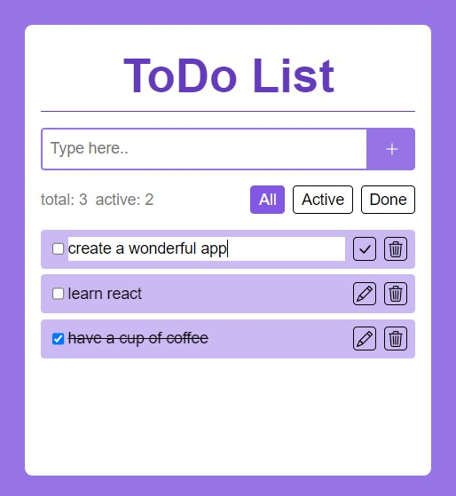

# ToDo List App

Простой список дел. Добавляйте, удаляйте, изменяйте, отмечайте выполненными свои задачи. Всегда отображается актуальная информация о количестве активных задач, а также общее количество задач.

## Технологии: React, TypeScript, Zustand, Vite, Sass.

## Описание функциональности

Приложении состоит из одной страницы.
Есть форма для добавления новой задачи. Нельзя добавить пустую задачу.
Отображается общее количество задач и количество активных задач.
Список задач можно фильтровать: `all, active, done`.
Каждую задачу из списка можно редактировать, отметить выполненной или удалить.

Задачи сохраняются в localStorage.

### Запуск проекта
`npm install`

`npm run dev`
